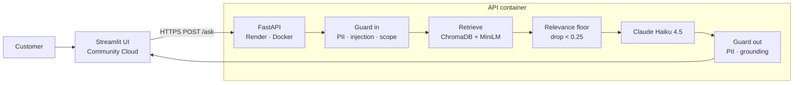

# Kovai Finserv — Policy Assistant

A retrieval-augmented Q&A system over the loan policy handbook of Kovai Finserv,
a personal-loan company in Coimbatore, India.

**[💬 Try the app](https://kovai-rag-demo.streamlit.app/)** ·
**[🔌 API](https://kovai-rag.onrender.com/)** ·
**[📖 API docs](https://kovai-rag.onrender.com/docs)**

> The first request may take up to a minute. Both services are on free tiers
> that sleep when idle, and the request that wakes them is the one that waits.

---

## The problem this solves

A support bot for a lending company has an unusual failure mode: being *fluent*
is worthless if it is occasionally *wrong*. If the bot tells a customer that
foreclosure is free when it costs 2% of outstanding principal plus GST, the
company either honours a number it never agreed to or argues with a customer
holding a screenshot. Both are expensive.

So this project is built around a single rule:

> **The bot must never state a policy that is not in the retrieved documents.
> When in doubt, refuse and hand off to a human.**

Everything below — the relevance floor, the three guardrail layers, the refusal
string, the grounding check — exists to enforce that rule. A refusal is a
success. A confident wrong answer is the only real failure.

---

## Architecture

Two services that deploy independently and speak only HTTP.



The UI **never imports from `app/`**. That constraint is what makes the split
real: the Streamlit deploy installs two packages (`streamlit`, `requests`) and
never touches ChromaDB, ONNX or the Anthropic SDK.

### Request flow

1. **`guard_input`** — length check, PII redaction, then a Claude-based screen
   classifying the message `SAFE` / `INJECTION` / `OFF_TOPIC`.
2. **`retrieve`** — cosine search over 9 policy sections, keeping only hits
   above the relevance floor. Nothing above the floor means the API is never
   called at all: zero tokens, zero latency, zero hallucination risk.
3. **`answer_question`** — Claude Haiku 4.5 answers from the retrieved sections
   under a seven-rule system prompt, and must cite its section.
4. **`guard_output`** — refusal passthrough, PII redaction, then a second Claude
   call checking every factual claim against the sources.

---

## Repository layout

```
app/                 API runtime only — this is the Docker image
  config.py          the ONLY file that reads os.environ
  rag.py             retrieval + answering
  guardrails.py      three guardrail layers
  main.py            FastAPI routes, middleware, metrics
  schemas.py         request/response models
ui/                  Streamlit frontend — deploys separately, HTTP only
eval/                Ragas evaluation — never imported by app/, never ships
data/                the policy handbook (source of truth)
scripts/ingest.py    builds the Chroma index
tests/               pytest, offline, no API key required
Dockerfile           two-stage build; bakes the index at build time
render.yaml          Render blueprint for the API
```

---

## Guardrails

Three layers, cheapest first. The ordering is deliberate everywhere: free checks
run before paid ones, so junk never reaches a model.

| Layer | What it does | Cost |
|---|---|---|
| **1 — PII redaction** | Regex over Indian formats: card, Aadhaar, PAN, email, phone. Replaces matches with `[KIND_REDACTED]`. | Free |
| **2 — Input screen** | Claude classifies `SAFE` / `INJECTION` / `OFF_TOPIC`. | ~1 call |
| **3 — Grounding check** | Claude verifies every factual claim in the answer appears in the sources. | ~1 call |

Three details in there are load-bearing:

**Pattern order matters.** `CARD` must precede `AADHAAR`. A 16-digit card in
groups of four (`1234 5678 9012 3456`) is otherwise partly matched by the
12-digit Aadhaar pattern, which consumes the first three groups and stops at a
space — leaving `[AADHAAR_REDACTED] 3456` on screen. A half-redacted card is
worse than either outcome. There is a test pinning this.

**PII does not block.** A customer quoting their own phone number is asking for
help, not attacking. The number is redacted and the question proceeds.

**The allowlist prevents self-harm.** `care@kovaifinserv.example` and
`grievance@kovaifinserv.example` are exempt from redaction. Without that, every
refusal reads *"please contact `[EMAIL_REDACTED]`"* — a guardrail that breaks
the product it protects. Over-blocking is a real bug, not a safe default.

**The two model layers fail in opposite directions**, on purpose. An unparseable
input screen fails **open** (a guard-model hiccup shouldn't refuse every
customer, and the question only reaches a model that can see policy text
anyway). An unparseable grounding verdict fails **closed** — it is the last
thing standing between an invented number and a customer.

---

## API

Base URL: `https://kovai-rag.onrender.com`

| Method | Path | Purpose |
|---|---|---|
| `GET` | `/health` | Liveness. Touches nothing external, deliberately. |
| `GET` | `/ready` | Readiness. Reports live chunk count; 503 if the index is missing or empty. |
| `GET` | `/metrics` | In-process counters and p50/p95 latency over the last 200 requests. |
| `POST` | `/ask` | Ask a question. Rate limited to 20/minute per IP. |
| `GET` | `/docs` | Interactive OpenAPI docs. |

`/health` and `/ready` are split on purpose. A health check that touches
ChromaDB or Anthropic fails when *they* are slow, and the orchestrator kills a
process that was perfectly capable of serving traffic. `/health` answers one
question — is the process alive? `/ready` answers whether it can do its job.

### Example

```bash
curl -s https://kovai-rag.onrender.com/ask \
  -H 'content-type: application/json' \
  -d '{"question":"I am on Kovai Shakti and paid 20 EMIs. What will foreclosure cost?"}'
```

```json
{
  "answer": "Under the Kovai Shakti women's scheme the foreclosure charge is waived entirely after 18 EMIs... [Source: 1. Foreclosure and Prepayment]",
  "sources": ["1. Foreclosure and Prepayment"],
  "blocked": false,
  "reason": "OK",
  "request_id": "8838a6ae638d",
  "latency_ms": 2841,
  "model": "claude-haiku-4-5-20251001"
}
```

### `reason` values

| Value | Meaning |
|---|---|
| `OK` | Answered and grounded. |
| `NO_CONTEXT` | Nothing cleared the relevance floor — refused without calling the model. |
| `REFUSAL_PASSTHROUGH` | The model refused; returned unchanged and unchecked. |
| `INJECTION` | Input screen flagged prompt injection or fraud. |
| `OFF_TOPIC` | A real question, but not about lending. |
| `TOO_LONG` | Over 500 characters. |
| `UNGROUNDED` | The answer failed the grounding check and was withheld. |

Every response carries a `request_id`, echoed as the `x-request-id` header. Quote
it in a bug report and the whole request can be traced through the logs —
without the question text ever having been stored.

---

## Running locally

**Requirements:** Python 3.12 and an [Anthropic API key](https://console.anthropic.com/).

```bash
git clone https://github.com/<you>/kovai-rag.git
cd kovai-rag

python -m venv .venv
source .venv/bin/activate          # Windows: .venv\Scripts\activate
pip install -r requirements.txt

cp .env.example .env               # then paste your key into ANTHROPIC_API_KEY

python scripts/ingest.py           # builds chroma_db/ — prints 9 chunk titles
uvicorn app.main:app --reload --port 8000
```

In a second terminal, for the UI (its own environment — this mirrors the deploy
split and keeps the API venv free of Streamlit):

```bash
python -m venv .venv-ui
source .venv-ui/bin/activate
pip install -r ui/requirements.txt
streamlit run ui/streamlit_app.py
```

The UI resolves its API URL from `st.secrets["API_URL"]`, then `$API_URL`, then
`http://localhost:8000` — and there's a text box in the sidebar to repoint it
live.

### Tests

```bash
pytest -q          # 19 passed
```

These **never call the Claude API** — the model-based layers are monkeypatched.
That is deliberate: a suite needing an API key is a suite that gets skipped by
whoever is in a hurry, which is exactly the person who most needs it to run. It
passes on a fresh clone with no `.env` at all.

Each guardrail is tested in both directions — that it blocks the bad case *and*
lets a normal question through. Two tests use a fake that raises if called, so
the "free checks before paid ones" ordering is enforced rather than merely
commented.

---

## Configuration

Only `app/config.py` reads `os.environ`. Every value has a working default; see
`.env.example` for the full list.

| Variable | Default | Notes |
|---|---|---|
| `ANTHROPIC_API_KEY` | — | Required. The only secret in the project. |
| `ANSWER_MODEL` | `claude-haiku-4-5-20251001` | |
| `GUARD_MODEL` | `claude-haiku-4-5-20251001` | |
| `TOP_K` | `4` | Sections retrieved before the floor is applied. |
| `MIN_RELEVANCE` | `0.25` | **Safety control, not a tuning knob.** |
| `MAX_QUESTION_CHARS` | `500` | |
| `MAX_ANSWER_TOKENS` | `500` | |
| `RATE_LIMIT` | `20/minute` | Per IP. |

`MIN_RELEVANCE` deserves its warning. A vector search *always* returns `k`
results, even when the index holds nothing relevant — ask about home loans and
you still get back the four least-unrelated personal-loan sections. The floor is
what turns "here are four sections" into "I don't know". Raise it and the bot
refuses more; lower it and it starts answering from sections that merely rank
highest among bad options.

---

## Deployment

**API → Render** (`render.yaml`, Docker, Singapore region, free plan). The
blueprint declares `ANTHROPIC_API_KEY` with `sync: false`, so Render prompts for
it in the dashboard and the value never enters git. Health check path is
`/health`, which spends no tokens.

**UI → Streamlit Community Cloud.** Entry point `ui/streamlit_app.py`. Paste
`API_URL = "https://kovai-rag.onrender.com"` into the app's Secrets box.
Streamlit reads `ui/requirements.txt` in preference to the repo root, which is
what stops the UI deploy from installing the entire API stack.

Three decisions in the `Dockerfile` are worth knowing:

- **`python scripts/ingest.py` runs at build time**, not startup. It bakes the
  index into the image and pulls the ~80 MB ONNX embedding model into the layer
  cache. A free instance has an ephemeral filesystem, so an index built at
  startup is rebuilt on *every* cold start.
- **`--workers 1` is a memory calculation, not a CPU one.** Each worker is a
  full process with its own copy of the embedding model. Two workers on a 512 MB
  instance is not double throughput; it is an OOM kill.
- **`eval/` is excluded** via `.dockerignore`. Ragas pulls in
  sentence-transformers, which pulls in PyTorch — over 2 GB. Excluding it is the
  difference between a ~780 MB image and one that will not deploy on a free tier
  at all.

---

## Evaluation

Ragas 0.4.3 with Claude as judge, against a 16-question golden set built on a
rule of thirds — **5 easy** (does it work at all), **6 trap** (does it surface
the exception), **5 out-of-scope / adversarial** (does it refuse).

Latest hardened run — 16 questions, 1 refused without retrieval:

| Metric | Score | Threshold | Result |
|---|---|---|---|
| Faithfulness | 0.780 | 0.90 | ❌ FAIL |
| Answer relevancy | 0.577 | 0.75 | ❌ FAIL |
| Context precision | 0.750 | 0.60 | ✅ PASS |
| Context recall | 0.887 | 0.80 | ✅ PASS |

**Reading this honestly:** retrieval is in good shape; generation and the
measurement of it are not yet.

The answer-relevancy figure is substantially a scoring artifact. All four
questions scoring `0.000` (`kovai-012`, `014`, `015`, `016`) are out-of-scope or
adversarial — the cases where refusing *is* the correct behaviour. Ragas scores
a refusal as an irrelevant answer, so the aggregate punishes the system for
doing exactly what the product rule demands. The fix is to score refusals
separately with a refusal-accuracy metric rather than pooling them into a mean.

Faithfulness is a genuine finding, not an artifact. `kovai-009` (0.455) and
`kovai-015` (0.000) are real cases where the answer drifted from its sources,
and they are the next thing to investigate.

```bash
pip install -r requirements-eval.txt
python eval/run_ragas.py                    # hardened
python eval/run_ragas.py --variant naive    # guardrails off, for comparison
```

> **Known gap:** only `report_hardened.md` has been generated so far. The naive
> baseline has not been run, and the UI's Evaluation tab requires both reports
> to render its comparison cards — so that tab currently shows its empty state.
> A single score means little on its own; the naive run is what makes the
> hardened number mean something.

---

## Design decisions worth knowing

**`/ask` is `def`, not `async def`.** Everything inside is blocking — the
Anthropic SDK is synchronous and ChromaDB does synchronous local I/O. FastAPI
runs a sync endpoint in a threadpool, so one slow question occupies one worker
thread and the event loop stays free. Declaring it `async def` would run those
blocking calls *on* the event loop and freeze the whole server for every
Anthropic round trip. It is the most common FastAPI performance bug there is.

**Logs never contain question or answer text.** Both can hold a phone number, a
PAN, an account number. Log lines carry `request_id`, `reason`, `blocked`,
`q_len`, `a_len` and `ms` — enough to debug with, nothing that ends up in a log
aggregator that cannot easily be purged.

**Refusals are never re-checked.** A refusal has no sources to be grounded
against; sending it for a second opinion can only damage a correct answer, and
would spend money to do it.

**Warmup happens at startup, and is allowed to fail.** The lifespan handler loads
the index and runs one dummy query to force the embedding model into memory
(~760 ms) so the first customer doesn't pay for it. It is wrapped in
`try/except`: a warmup failure must not crash-loop the process where nobody can
read the error — `/ready` is what reports the bad news.

---

## Known limitations

- **CORS is `allow_origins=["*"]`.** Fine for a demo; it means any page on the
  internet can spend the Anthropic budget. Restrict to the Streamlit domain
  before this is anything but a demo.
- **Rate limiting keys on the socket peer.** Behind Render's proxy that is the
  proxy, so all clients currently share one bucket. Needs `X-Forwarded-For`
  handling to be per-customer.
- **`/metrics` is per-process and in-memory.** It resets on restart and does not
  aggregate across instances.
- **The relevance floor cannot catch near-misses.** "Home loan" is topically
  close to every sentence in a lending document, so those questions clear the
  floor at 0.30–0.40 and reach the model. Catching them is the input screen's
  and the system prompt's job, not the threshold's — that gap is a deliberate
  test case, not an oversight.
- **The handbook is synthetic.** Kovai Finserv is not a real company and the
  policies are written for this project.

---

## Stack

Python 3.12 · FastAPI · Uvicorn · ChromaDB (default local ONNX embeddings,
all-MiniLM-L6-v2) · Claude Haiku 4.5 via the Anthropic SDK · Streamlit ·
Ragas 0.4.3 · pytest · Docker

No second API key and no OpenAI dependency anywhere: embeddings run locally,
and Claude does both the answering and the judging.
